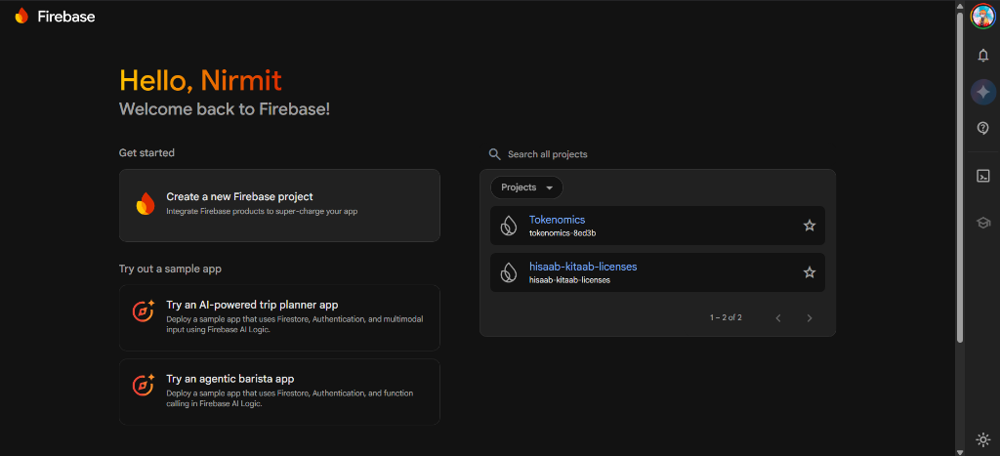
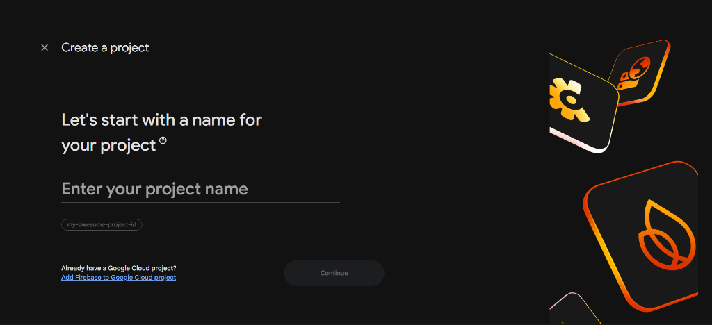
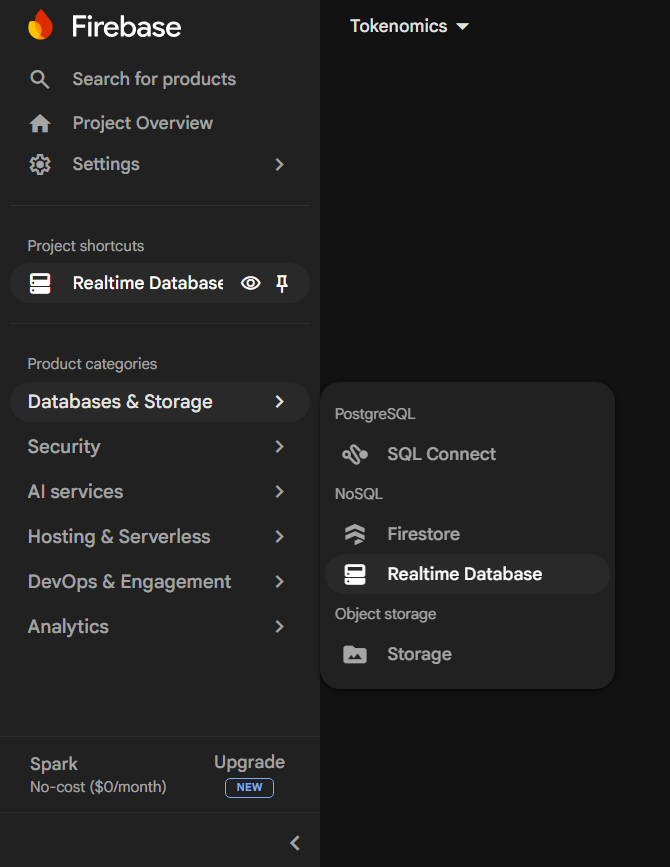
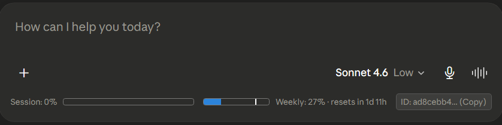

<h1 align="center">Tokenomics 🪙 - AI Usage Tracker (Android)</h1>

  <strong>The ultimate companion app for tracking your AI token usage across multiple providers in real-time.</strong>

Tokenomics is a sleek, modern Android application that helps you monitor your AI API limits and token usage across Anthropic (Claude), OpenAI, Google AI Studio, and more. It pairs directly with the Tokenomics Chrome Extension, allowing you to track your multi-account usage directly from your phone.

---

## ✨ Features

- 📊 **Claude Provider Support:** Track usage limits for Anthropic Claude (Live Session Tokens & Console API Keys). (Other AI platforms coming soon!)
- ⚡ **Real-Time Firebase Sync:** Usage data syncs instantly from your Tokenomics Chrome Extension to your mobile device.
- 🔔 **Smart Notifications:** Native Android background alarms alert you when you are nearing your hourly or weekly token caps without draining your battery.
- 🔒 **Privacy First:** Your API keys are encrypted and stored locally in your device's native Android Keystore. **No keys are sent to any external servers.**
- 🚀 **Over-The-Air (OTA) Updates:** The app automatically checks GitHub for new versions on startup and seamlessly installs updates directly on your device.
- 🎨 **Beautiful UI:** A dark-mode optimized, glassmorphic interface built using Flutter and Riverpod.

---

## 📱 How to Install (For Regular Users)

If you just want to use the app to track your tokens, you don't need to write any code! Just install the APK:

1. Go to the [Releases Page](https://github.com/User69-og/Tokenomics-Android/releases) of this repository.
2. Click on the latest release and download the **`app-release.apk`** file to your Android phone.
3. Open the downloaded file to install it. *(Note: You may need to allow "Install from unknown sources" in your Android Settings).*
4. Once installed, future updates will automatically notify you inside the app and install with a single tap!

---

## 🛠️ Setup & Configuration (Step-by-Step)

Once you open the app, you need to connect your accounts to start tracking usage.

### 1. Creating Your Firebase Database
Both the Android App and the Chrome Extension need a place to sync data. We use a free Firebase Realtime Database for this.

1. Go to the [Firebase Console](https://console.firebase.google.com/) and click **"Create a project"**.

2. Give your project a name (like "Tokenomics") and click **Continue**.

3. On the left sidebar, click on **Databases & Storage** → **Realtime Database**.

4. Click **"Create Database"**, choose your nearest location, and start in **Test Mode** (so the app can read/write data easily).
5. Once created, you will see a large URL at the top that looks like `https://your-project-default-rtdb.firebaseio.com/`. **Copy this URL.**

### 2. Linking the Apps Together
Now that you have your database URL:
1. Open the **Tokenomics Chrome Extension** on your desktop.
2. Go to the Extension Settings, paste the URL into the Firebase field, and save.
3. Open the **Tokenomics Android App**, tap the Settings icon (⚙️) in the top right.
4. Paste the exact same URL into the input field and save. 

That's it! Your browser and phone are now securely syncing in real-time.

### 2. Adding AI Accounts
Tap the **"+"** button on the Home Screen to add your AI accounts. Depending on the provider, you will need a specific key:

* **Anthropic Claude (Live Usage %):** 
  To see your live 5-hour messaging limits on Claude.ai:
  1. Open claude.ai in your desktop browser with the Tokenomics Chrome Extension active.
  2. Look at the usage bars at the bottom of the chat interface.
  3. Click the **"ID: ... (Copy)"** button next to the bars.
  
  

  4. Paste this ID into the app.

---

- **Local Storage:** `flutter_secure_storage` is used to encrypt all session tokens and API keys using AES encryption backed by the Android Keystore.
- **Firebase:** The Realtime Database is only used as a transient middleman to pass usage statistics (numbers and percentages) between the extension and the phone. **Credentials are never uploaded to Firebase.**
- **Network Requests:** All API requests to fetch token limits are made locally directly from your device to the respective provider's official API endpoints.

---

## 📝 License

This project is licensed under the MIT License - see the LICENSE file for details.
